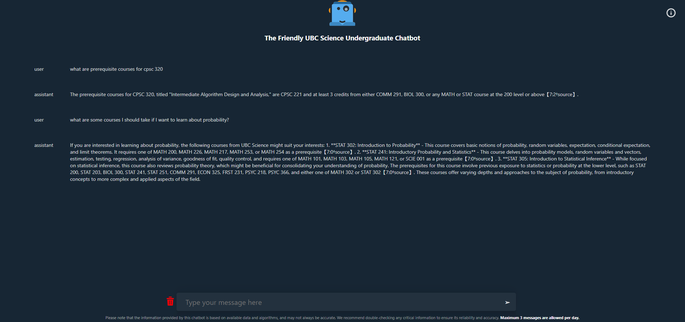

# UBC Science Chatbot
https://zaidlkhan.github.io/ubc_chatbot_frontend1/

A Chatbot powered by OpenAI's API tailored for UBC science students.

### Website Preview

### Example Queries
 -  What are some prerequisite courses for XPSX 340?
 -  What are some courses about cell biology?
 -  What are some 300 level COGS courses?

### Capabilities
 -  Remembers what user said earlier in the conversation.
 -  Allows user to provide follow-up corrections.
 -  Trained to decline inappropriate requests.

### Limitations
 - May occasionally generate incorrect information.
 - A max of 3 messages can be sent a daily.
 - Has limited knowledge specific to UBC
